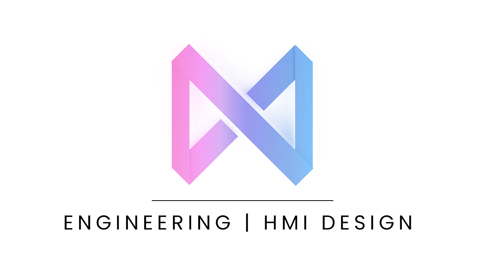

# nekox.net

Powered by [Jekyll](https://jekyllrb.com/), which itself is based on the [JamStack](https://jamstack.org/) architecture, built on [WhatATheme](https://github.com/thedevslot/WhatATheme), hosted on [GitHub Pages](https://pages.github.com/), re-engineered and re-designed with lots of snek :purple_heart: by [Mikanwolfe](https://github.com/Mikanwolfe).

### Changes/Modifications

* Core WhatATheme functionality for projects, blogging, and the showcase has not changed.
* Showcase contents include additional recommendations and highlights
* Projects moved to showcase
* ...and quite a lot more.

---

### Content Credits
* [Font Awesome](https://fontawesome.com/)
* [Poppins Font](https://fonts.google.com/specimen/Poppins)

---

### WhatATheme Credits
* [Sneha Omer](http://sassyecoder.github.io/)
* [Harsh Trivedi](http://harsh98trivedi.github.io/)

### License
The contents of this repository are licensed under the [**GNU General Public License v2.0**](https://github.com/thedevslot/WhatATheme/blob/master/LICENSE)
